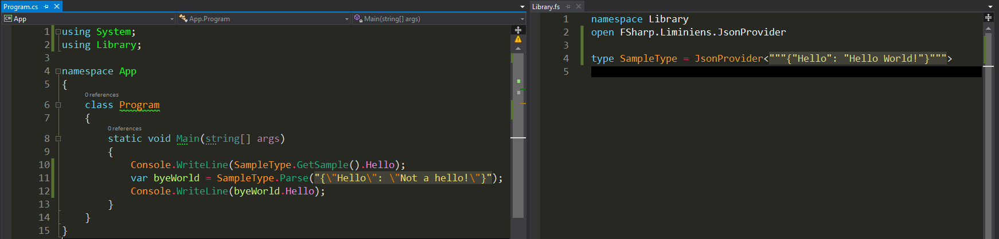

# Json generative type provider

This is a F# type provider which allows you to generate types from string json sample and then use them in F# or C# project.

## Status

| OS      | Build & Test |
|---------|--------------|
| Mac OS  |  |
| Linux   |  |
| Windows |  |

Paket is used to acquire the type provider SDK and build the nuget package.

Building:

    .paket\paket.exe update

    dotnet build -c release

    .paket\paket.exe pack src\JsonProvider.Runtime\paket.template --version 0.0.1
